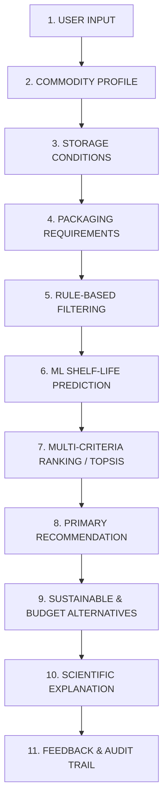

# PackWise AI - End-to-End Decision Pipeline

This document defines the 11-stage decision and computational pipeline for the **PackWise AI** food packaging recommendation system.

## Detailed Stage Specifications

### Stage 1: User Input
- Captures food commodity name, produce category, supply chain requirements, and environmental priorities (e.g., target shelf life, budget caps, biodegradable mandate).
- Form validated against Pydantic schema contracts.

### Stage 2: Food / Commodity Profile Retrieval
- Resolves biological properties:
  - Respiration Rate ($R_{\text{CO}_2}, R_{\text{O}_2}$) at baseline temperature.
  - Critical water activity ($a_w$) and moisture vulnerability.
  - Ethylene and light sensitivities.

### Stage 3: Storage Conditions
- Environmental logistics parameters:
  - Target temperature range ($T$ in °C).
  - Ambient relative humidity ($\text{RH}$ in %).
  - Cold chain regime (Strict Cold Chain, Intermittent, Ambient).

### Stage 4: Packaging Requirements Calculation
- Derives minimum acceptable barrier properties:
  - Maximum allowable Oxygen Transmission Rate (OTR).
  - Maximum allowable Water Vapor Transmission Rate (WVTR).
  - Puncture resistance, tensile strength, and hermetic sealability.

### Stage 5: Rule-Based Filtering
- Deterministic exclusion layer:
  - **Food Contact Rule**: Eliminates non-certified substrates.
  - **Moisture Weakness Rule**: Rejects water-sensitive films in high humidity environments.
  - **Thermal Limit Rule**: Filters films whose glass transition ($T_g$) or melting temperature is incompatible with storage.

### Stage 6: Machine Learning Prediction (Phase 1 Ingestion Target)
- Predicts dynamic degradation curves and days-to-failure using gradient boosted regression trees (XGBoost).
- Inputs: Respiration kinetics, barrier transmission rates, ambient thermal dynamics.

### Stage 7: Multi-Criteria Ranking (TOPSIS Engine)
- Technique for Order of Preference by Similarity to Ideal Solution:
  - Evaluates remaining candidates against a normalized decision matrix.
  - Weighted Euclidean distance to Positive-Ideal Solution ($S_i^*$) and Negative-Ideal Solution ($S_i^-$).
  - Calculates relative closeness score $C_i^* = \frac{S_i^-}{S_i^* + S_i^-}$.

### Stage 8: Primary Recommendation
- Emits the Top-1 packaging polymer film and optional Modified Atmosphere Packaging (MAP) gas mixture ($\% \text{O}_2, \% \text{CO}_2, \% \text{N}_2$).

### Stage 9: Tradeoff Alternatives
- Provides:
  - **Best Eco-Friendly Alternative** (highest sustainability / compostability score).
  - **Best Budget Alternative** (lowest economic cost index satisfying minimum safety rules).

### Stage 10: Scientific Explanation
- Provides transparent justification citing ASTM standards (D3985, F1249), barrier transmission metrics, and respiration balance.

### Stage 11: Feedback & Audit Logging
- Persists request payload, decision vectors, and user acceptance status in PostgreSQL `recommendations` table for continuous auditability.
